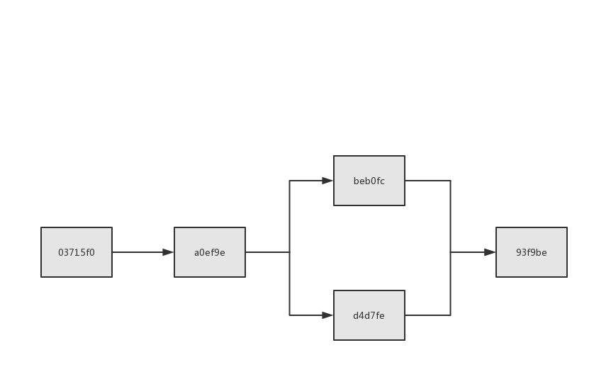
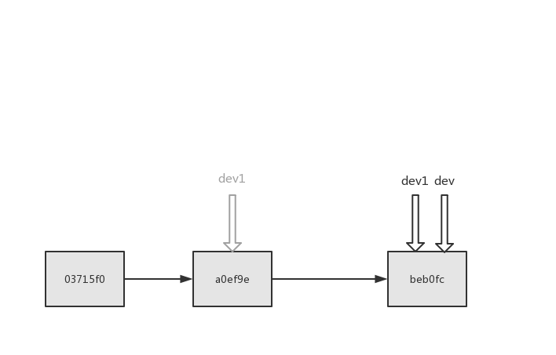
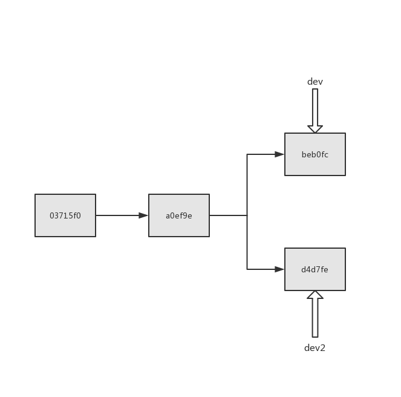
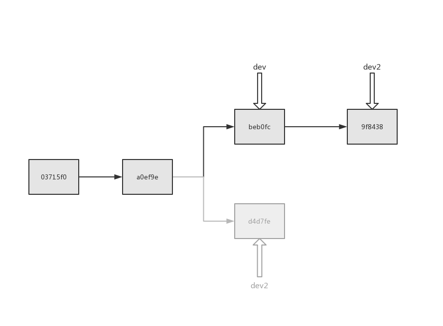
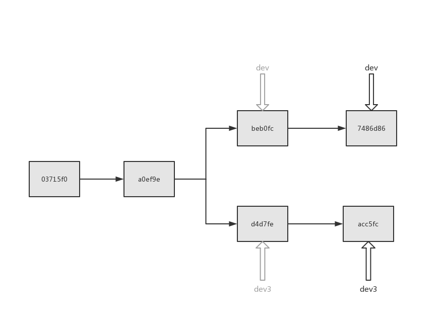
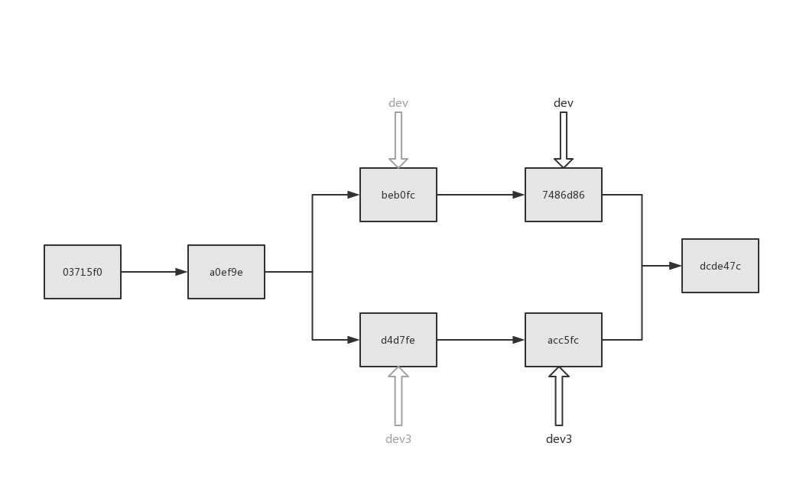

# Git 解密

1. git add 
2. git commit
3. git log
4. git branch
5. git checkout
6. git reset
7. git merge
8. git rebase

## 直接记录快照，而非差异比较
>Git 和其它版本控制系统（包括 Subversion 和近似工具）的主要差别在于 Git 对待数据的方法。 概念上来区分，其它大部分系统以文件变更列表的方式存储信息。 这类系统（CVS、Subversion、Perforce、Bazaar 等等）将它们保存的信息看作是**一组基本文件和每个文件随时间逐步累积的差异**。


>Git 更像是把数据看作是对小型文件系统的一组快照。 每次你提交更新，或在 Git 中保存项目状态时，它主要**对当时的全部文件制作一个快照并保存这个快照的索引**。 为了高效，如果文件没有修改，Git 不再重新存储该文件，而是只保留一个链接指向之前存储的文件。 Git 对待数据更像是一个快照流。

## 创建一个git仓库
```
$ git init
Initialized empty Git repository in D:/workspace/git-demo/.git/
```
### git目录：
```
$ ls .git/ -F1
config
description
HEAD
hooks/
info/
objects/
refs/
```
```
$ cat .git/config
$ git config --local -l
```
```
$ cat .git/HEAD
```
```
$ find .git/objects/ -type f

```
### 添加一个文件：
```
$ touch file1
$ git add file1
```
```
$ find .git/objects/ -type f
.git/objects/e6/9de29bb2d1d6434b8b29ae775ad8c2e48c5391
```
```
$ git cat-file -p e69de

```
```
$ echo 'hello world' > file1
$ find .git/objects/ -type f
.git/objects/3b/18e512dba79e4c8300dd08aeb37f8e728b8dad
.git/objects/e6/9de29bb2d1d6434b8b29ae775ad8c2e48c5391
$ git cat-file -p 3b18e
hello world
```
### 提交文件
```
$ git commit -m 'commit file1 with "hello world"'
[master (root-commit) 03715f0] commit file1 with "hello world"
 1 file changed, 1 insertion(+)
 create mode 100644 file1

 $ find .git/objects/ -type f
.git/objects/03/715f0b022f208b38fb7607360ae24f0661cd17
.git/objects/3b/18e512dba79e4c8300dd08aeb37f8e728b8dad
.git/objects/c8/f5514375be193ba3c4716a89d91d8f393cba2e
.git/objects/e6/9de29bb2d1d6434b8b29ae775ad8c2e48c5391
```

```
$ git cat-file -p 0371
tree c8f5514375be193ba3c4716a89d91d8f393cba2e
author Jack Feng <879721421@qq.com> 1566231492 +0800
committer Jack Feng <879721421@qq.com> 1566231492 +0800

commit file1 with "hello world"

$ git cat-file -p c8f5514375be1
100644 blob 3b18e512dba79e4c8300dd08aeb37f8e728b8dad    file1
```

### 提交第二个版本
```
$ echo 'hello git' >> file1
```
```
$ cat file1
hello world
hello git
```
```
$ find .git/objects/ -type f
.git/objects/03/715f0b022f208b38fb7607360ae24f0661cd17
.git/objects/3b/18e512dba79e4c8300dd08aeb37f8e728b8dad
.git/objects/c8/f5514375be193ba3c4716a89d91d8f393cba2e
.git/objects/e6/9de29bb2d1d6434b8b29ae775ad8c2e48c5391
```
```
$ git add file1
$ find .git/objects -type f
.git/objects/03/715f0b022f208b38fb7607360ae24f0661cd17
.git/objects/3b/18e512dba79e4c8300dd08aeb37f8e728b8dad
.git/objects/c8/f5514375be193ba3c4716a89d91d8f393cba2e
.git/objects/c9/40fc8d96f03c8bc23eabd2b8af558afde227f9
.git/objects/e6/9de29bb2d1d6434b8b29ae775ad8c2e48c5391

$ git cat-file -p c940fc
hello world
hello git
```

```
$ git commit -m 'commit file1 (Ver.2) with appending "hello git"'
$  find .git/objects/ -type f
.git/objects/03/715f0b022f208b38fb7607360ae24f0661cd17
.git/objects/3b/18e512dba79e4c8300dd08aeb37f8e728b8dad
.git/objects/a0/ef9e3507d4393391e187b46bea76ad471efab2
.git/objects/be/e32eb5a7c0624f388fd4db29f27d42daf34617
.git/objects/c8/f5514375be193ba3c4716a89d91d8f393cba2e
.git/objects/c9/40fc8d96f03c8bc23eabd2b8af558afde227f9
.git/objects/e6/9de29bb2d1d6434b8b29ae775ad8c2e48c5391

$ git cat-file -p a0ef9
tree bee32eb5a7c0624f388fd4db29f27d42daf34617
parent 03715f0b022f208b38fb7607360ae24f0661cd17
author Jack Feng <879721421@qq.com> 1566233154 +0800
committer Jack Feng <879721421@qq.com> 1566233154 +0800

commit file1 (Ver.2) with appending "hello git"

$ git cat-file -p bee32eb5a7
100644 blob c940fc8d96f03c8bc23eabd2b8af558afde227f9    file1

$ git cat-file -p 03715f0
tree c8f5514375be193ba3c4716a89d91d8f393cba2e
author Jack Feng <879721421@qq.com> 1566231492 +0800
committer Jack Feng <879721421@qq.com> 1566231492 +0800

commit file1 with "hello world"
```

```
$ cat .git/HEAD
ref: refs/heads/master

$ cat .git/refs/heads/master
a0ef9e3507d4393391e187b46bea76ad471efab2
```

```
$ git log
commit a0ef9e3507d4393391e187b46bea76ad471efab2 (HEAD -> master)
Author: Jack Feng <879721421@qq.com>
Date:   Tue Aug 20 00:45:54 2019 +0800

    commit file1 (Ver.2) with appending "hello git"

commit 03715f0b022f208b38fb7607360ae24f0661cd17
Author: Jack Feng <879721421@qq.com>
Date:   Tue Aug 20 00:18:12 2019 +0800

```

## 分支的实质 （HEAD和Ref）

#### 切换新分支(dev)：
```
$ git branch dev
$ cat .git/refs/heads/dev
a0ef9e3507d4393391e187b46bea76ad471efab2

$ git checkout dev

$ cat .git/HEAD
ref: refs/heads/dev

$ cat .git/refs/heads/dev
a0ef9e3507d4393391e187b46bea76ad471efab2

$ git log
```

#### 在dev分支上提交：
```
$ touch file2
$ git add file2
$ git commit -m 'add file2'
$ find .git/objects/ -type f
.git/objects/03/715f0b022f208b38fb7607360ae24f0661cd17
.git/objects/3b/18e512dba79e4c8300dd08aeb37f8e728b8dad
.git/objects/9e/d8a8a9e6055af50ac69972ea3a2ed0ba40d467
.git/objects/a0/ef9e3507d4393391e187b46bea76ad471efab2
.git/objects/be/b0fc375468d68f57011f471229de0a0660fb0a
.git/objects/be/e32eb5a7c0624f388fd4db29f27d42daf34617
.git/objects/c8/f5514375be193ba3c4716a89d91d8f393cba2e
.git/objects/c9/40fc8d96f03c8bc23eabd2b8af558afde227f9
.git/objects/e6/9de29bb2d1d6434b8b29ae775ad8c2e48c5391
```

```
$ git cat-file -p beb0f
tree 9ed8a8a9e6055af50ac69972ea3a2ed0ba40d467
parent a0ef9e3507d4393391e187b46bea76ad471efab2
author Jack Feng <879721421@qq.com> 1566234084 +0800
committer Jack Feng <879721421@qq.com> 1566234084 +0800

add file2

$ git cat-file -p 9ed8a8
100644 blob c940fc8d96f03c8bc23eabd2b8af558afde227f9    file1
100644 blob e69de29bb2d1d6434b8b29ae775ad8c2e48c5391    file2
```

```
$ cat .git/refs/heads/dev
beb0fc375468d68f57011f471229de0a0660fb0a

$ cat .git/refs/heads/master
a0ef9e3507d4393391e187b46bea76ad471efab2
```

```
$ git reset a0ef9e

$ cat .git/HEAD
ref: refs/heads/dev

$ cat .git/refs/heads/dev
a0ef9e3507d4393391e187b46bea76ad471efab2
```

```
$ git reset beb0fc3

$ cat .git/refs/heads/dev
beb0fc375468d68f57011f471229de0a0660fb0a
```

## 重置解密 (HEAD、Index 和 Working Directory)

[重置解密](https://git-scm.com/book/zh/v2/Git-工具-重置揭密)
```
$ ls .git/ -F1
COMMIT_EDITMSG
config
description
HEAD
hooks/
index  <--------------- index
info/
logs/
objects/
ORIG_HEAD
refs/
```

```
$ cat .git/index

$ git ls-files -s
100644 c940fc8d96f03c8bc23eabd2b8af558afde227f9 0       file1
100644 e69de29bb2d1d6434b8b29ae775ad8c2e48c5391 0       file2
```

### git reset [--soft, --mixed, --hard]

#### git reset --soft
```
$ cat .git/refs/heads/dev
beb0fc375468d68f57011f471229de0a0660fb0a

$ git reset --soft HEAD~

$ cat .git/refs/heads/dev
a0ef9e3507d4393391e187b46bea76ad471efab2

$ git log
commit a0ef9e3507d4393391e187b46bea76ad471efab2 (HEAD -> dev, master)
Author: Jack Feng <879721421@qq.com>
Date:   Tue Aug 20 00:45:54 2019 +0800

    commit file1 (Ver.2) with appending "hello git"

commit 03715f0b022f208b38fb7607360ae24f0661cd17
Author: Jack Feng <879721421@qq.com>
Date:   Tue Aug 20 00:18:12 2019 +0800

    commit file1 with "hello world"

$ git reset --soft beb0fc
```

#### git reset --mixed

```
$ echo 'file2 first line' > file2
$ git add file2

$ git ls-files -s
100644 c940fc8d96f03c8bc23eabd2b8af558afde227f9 0       file1
100644 cd945c013ab21046ec0807394908b27247ce579b 0       file2

$ git cat-file -p cd945c
file2 first line
```

```
$ git reset --mixed HEAD
Unstaged changes after reset:
M       file2

$ git ls-files -s
100644 c940fc8d96f03c8bc23eabd2b8af558afde227f9 0       file1
100644 e69de29bb2d1d6434b8b29ae775ad8c2e48c5391 0       file2

$ git add file2
```

#### git reset --hard

```
$ git reset --hard HEAD
HEAD is now at beb0fc3 add file2

$ git ls-files -s
100644 c940fc8d96f03c8bc23eabd2b8af558afde227f9 0       file1
100644 e69de29bb2d1d6434b8b29ae775ad8c2e48c5391 0       file2

$ cat file2

```

#### 在文件上：
```
$ cat .git/refs/heads/dev
beb0fc375468d68f57011f471229de0a0660fb0a

$ git reset 03715f0 file1
Unstaged changes after reset:
M       file1

$ git ls-files -s
100644 3b18e512dba79e4c8300dd08aeb37f8e728b8dad 0       file1
100644 e69de29bb2d1d6434b8b29ae775ad8c2e48c5391 0       file2

$ cat file1
hello world
hello git

$ git cat-file -p 3b18e512
hello world

$ cat .git/refs/heads/dev
beb0fc375468d68f57011f471229de0a0660fb0a
```

> 一个有意思的现象：
> ```
> $ git status
> On branch dev
> Changes to be committed:
>  (use "git reset HEAD <file>..." to unstage)
>
>        modified:   file1
>
> Changes not staged for commit:
>  (use "git add <file>..." to update what will be committed)
>  (use "git checkout -- <file>..." to discard changes in working directory)
>
>        modified:   file1
>
> ```

### git checkout

```
$ git checkout master
Switched to branch 'master'

$ cat .git/HEAD
ref: refs/heads/master

$ git ls-files -s
100644 c940fc8d96f03c8bc23eabd2b8af558afde227f9 0       file1

$ ls
file1
```

> git checkout 会在检出时检查index和工作目录
> ```
> $ touch file2
> $ git checkout dev
> error: The following untracked working tree files would be > overwritten by checkout:
>         file2
> Please move or remove them before you switch branches.
> Aborting
> 
> $ rm file2
> 
> $ git checkout dev
> Switched to branch 'dev'
> ```
#### 在文件上：

```
$ cat file1
hello world
hello git

$ git checkout 03715f0b02 file1

$ cat file1
hello world

$ git ls-files -s
100644 3b18e512dba79e4c8300dd08aeb37f8e728b8dad 0       file1
100644 e69de29bb2d1d6434b8b29ae775ad8c2e48c5391 0       file2

$ git cat-file -p 3b18e512dba7
hello world
```

## 分支合并

### git merge

```
$ git log
commit beb0fc375468d68f57011f471229de0a0660fb0a (HEAD -> dev)
Author: Jack Feng <879721421@qq.com>
Date:   Tue Aug 20 01:01:24 2019 +0800

    add file2

commit a0ef9e3507d4393391e187b46bea76ad471efab2 (master)
Author: Jack Feng <879721421@qq.com>
Date:   Tue Aug 20 00:45:54 2019 +0800

    commit file1 (Ver.2) with appending "hello git"

commit 03715f0b022f208b38fb7607360ae24f0661cd17
Author: Jack Feng <879721421@qq.com>
Date:   Tue Aug 20 00:18:12 2019 +0800

    commit file1 with "hello world"
```

##### 在master分支上提交新文件"file3", 与dev分支合并:

```
$ git checkout master

$ touch file3

$ git add file3

$ git commit -m 'add file3'

$ git ls-files -s
100644 c940fc8d96f03c8bc23eabd2b8af558afde227f9 0       file1
100644 e69de29bb2d1d6434b8b29ae775ad8c2e48c5391 0       file3

$ git merge dev

$ git ls-files -s
100644 c940fc8d96f03c8bc23eabd2b8af558afde227f9 0       file1
100644 e69de29bb2d1d6434b8b29ae775ad8c2e48c5391 0       file2
100644 e69de29bb2d1d6434b8b29ae775ad8c2e48c5391 0       file3
```

##### 日志结构：

```
$ git log
commit 93f9be123444896cf40be77782377c29ff717a59 (HEAD -> master)
Merge: d4d7fe8 beb0fc3
Author: Jack Feng <879721421@qq.com>
Date:   Wed Aug 21 00:45:06 2019 +0800

    Merge branch 'dev'

commit d4d7fe87a1e5ba3543d373da7b0c708cef6be368
Author: Jack Feng <879721421@qq.com>
Date:   Wed Aug 21 00:42:39 2019 +0800

    add file3

commit beb0fc375468d68f57011f471229de0a0660fb0a (dev)
Author: Jack Feng <879721421@qq.com>
Date:   Tue Aug 20 01:01:24 2019 +0800

    add file2

commit a0ef9e3507d4393391e187b46bea76ad471efab2
Author: Jack Feng <879721421@qq.com>
Date:   Tue Aug 20 00:45:54 2019 +0800

    commit file1 (Ver.2) with appending "hello git"

commit 03715f0b022f208b38fb7607360ae24f0661cd17
Author: Jack Feng <879721421@qq.com>
Date:   Tue Aug 20 00:18:12 2019 +0800

    commit file1 with "hello world"

```

```
$ git cat-file -p d4d7fe87a1e5
tree e66b6e08290025b5ac77687f4ac224107bda89d4
parent a0ef9e3507d4393391e187b46bea76ad471efab2
author Jack Feng <879721421@qq.com> 1566319359 +0800
committer Jack Feng <879721421@qq.com> 1566319359 +0800

add file3

$ git cat-file -p beb0fc375468d6
tree 9ed8a8a9e6055af50ac69972ea3a2ed0ba40d467
parent a0ef9e3507d4393391e187b46bea76ad471efab2
author Jack Feng <879721421@qq.com> 1566234084 +0800
committer Jack Feng <879721421@qq.com> 1566234084 +0800

add file2

$ git cat-file -p 93f9be123444
tree 266b34d9364978fd772a4b08e0bb81e48fcb652f
parent d4d7fe87a1e5ba3543d373da7b0c708cef6be368
parent beb0fc375468d68f57011f471229de0a0660fb0a
author Jack Feng <879721421@qq.com> 1566319506 +0800
committer Jack Feng <879721421@qq.com> 1566319506 +0800

Merge branch 'dev'
```


#### fast-forward
```
$ git checkout -b dev1 a0ef9e
$ git merge dev
Updating a0ef9e3..beb0fc3
Fast-forward
 file2 | 0
 1 file changed, 0 insertions(+), 0 deletions(-)
 create mode 100644 file2

 $ git log
commit beb0fc375468d68f57011f471229de0a0660fb0a (HEAD -> dev1, dev)
Author: Jack Feng <879721421@qq.com>
Date:   Tue Aug 20 01:01:24 2019 +0800

    add file2

commit a0ef9e3507d4393391e187b46bea76ad471efab2
Author: Jack Feng <879721421@qq.com>
Date:   Tue Aug 20 00:45:54 2019 +0800

    commit file1 (Ver.2) with appending "hello git"

commit 03715f0b022f208b38fb7607360ae24f0661cd17
Author: Jack Feng <879721421@qq.com>
Date:   Tue Aug 20 00:18:12 2019 +0800

    commit file1 with "hello world"

```


### git rebase

#### 创建新的分支dev2：
```
$ git checkout -b dev2 d4d7fe
```

#### rebase dev
```
$ git rebase dev

$ git log
commit 9f8438fdce28994dc03ae1cef19f45ca6c66d7da (HEAD -> dev2)
Author: Jack Feng <879721421@qq.com>
Date:   Wed Aug 21 00:42:39 2019 +0800

    add file3

commit beb0fc375468d68f57011f471229de0a0660fb0a (dev1, dev)
Author: Jack Feng <879721421@qq.com>
Date:   Tue Aug 20 01:01:24 2019 +0800

    add file2

commit a0ef9e3507d4393391e187b46bea76ad471efab2
Author: Jack Feng <879721421@qq.com>
Date:   Tue Aug 20 00:45:54 2019 +0800

    commit file1 (Ver.2) with appending "hello git"

commit 03715f0b022f208b38fb7607360ae24f0661cd17
Author: Jack Feng <879721421@qq.com>
Date:   Tue Aug 20 00:18:12 2019 +0800

    commit file1 with "hello world"

$ git cat-file -p 9f8438fdc
tree 266b34d9364978fd772a4b08e0bb81e48fcb652f
parent beb0fc375468d68f57011f471229de0a0660fb0a   <----------- dev
author Jack Feng <879721421@qq.com> 1566319359 +0800
committer Jack Feng <879721421@qq.com> 1566401481 +0800

add file3
```


```
$ git cat-file -p master
tree 266b34d9364978fd772a4b08e0bb81e48fcb652f    <------------ 与dev2相同
parent d4d7fe87a1e5ba3543d373da7b0c708cef6be368
parent beb0fc375468d68f57011f471229de0a0660fb0a
author Jack Feng <879721421@qq.com> 1566319506 +0800
committer Jack Feng <879721421@qq.com> 1566319506 +0800

Merge branch 'dev'
```

### 解决冲突

#### 创建新的分支dev3:
```
$ git checkout -b dev3 d4d7fe
```
#### 分别在dev和dev3上修改file1：
```
$ echo 'new file1' > file1
$ git add file1
$ git commit -m 'replace file1'
[dev3 acc5fc6] replace file1
 1 file changed, 1 insertion(+), 2 deletions(-)

$ git checkout dev
$ echo 'dev new line' > file1
$ git add file1
$ git commit -m 'replace file1 on dev'
[dev 7486d86] replace file1 on dev
 1 file changed, 1 insertion(+), 2 deletions(-)

```

##### index区:
```
$ git ls-files -s
100644 582b6f7571a42070ecfb2945273a29571ea070ed 0       file1
100644 e69de29bb2d1d6434b8b29ae775ad8c2e48c5391 0       file2
```
##### Git仓库：
```
$ git cat-file -p HEAD
tree e1d3ab31ccde0aa81cbe3263710ce4b978c7c2d8
parent beb0fc375468d68f57011f471229de0a0660fb0a
author Jack Feng <879721421@qq.com> 1566404140 +0800
committer Jack Feng <879721421@qq.com> 1566404140 +0800

replace file1 on dev

$ git cat-file -p e1d3ab
100644 blob 582b6f7571a42070ecfb2945273a29571ea070ed    file1   <---------
100644 blob e69de29bb2d1d6434b8b29ae775ad8c2e48c5391    file2

$ git cat-file -p dev3
tree 84b4e0b94c15892d9dc838283a10e28c1f3cba04
parent d4d7fe87a1e5ba3543d373da7b0c708cef6be368
author Jack Feng <879721421@qq.com> 1566402927 +0800
committer Jack Feng <879721421@qq.com> 1566402927 +0800

replace file1

$ git cat-file -p 84b4e0b9
100644 blob 26f8bd9b54c8ac43991972447145a7988ad99105    file1   <---------
100644 blob e69de29bb2d1d6434b8b29ae775ad8c2e48c5391    file3
```
#### 合并dev和dev3
```
$ git merge dev3
Auto-merging file1
CONFLICT (content): Merge conflict in file1
Automatic merge failed; fix conflicts and then commit the result.
```
**出现冲突！**
```
Jack Feng@DESKTOP-MO2MV04 MINGW64 /d/workspace/git-demo (dev|MERGING) <---------
$ git log
commit 7486d86bc7af3e13a29a75fb0239512b5dacf515 (HEAD -> dev)  <--------
Author: Jack Feng <879721421@qq.com>
Date:   Thu Aug 22 00:15:40 2019 +0800

    replace file1 on dev

commit beb0fc375468d68f57011f471229de0a0660fb0a (dev1)
Author: Jack Feng <879721421@qq.com>
Date:   Tue Aug 20 01:01:24 2019 +0800

    add file2

commit a0ef9e3507d4393391e187b46bea76ad471efab2
Author: Jack Feng <879721421@qq.com>
Date:   Tue Aug 20 00:45:54 2019 +0800

    commit file1 (Ver.2) with appending "hello git"

commit 03715f0b022f208b38fb7607360ae24f0661cd17
Author: Jack Feng <879721421@qq.com>
Date:   Tue Aug 20 00:18:12 2019 +0800

    commit file1 with "hello world"
```
##### index区：
```
$ git ls-files -s
100644 c940fc8d96f03c8bc23eabd2b8af558afde227f9 1       file1  <----- ?
100644 582b6f7571a42070ecfb2945273a29571ea070ed 2       file1
100644 26f8bd9b54c8ac43991972447145a7988ad99105 3       file1
100644 e69de29bb2d1d6434b8b29ae775ad8c2e48c5391 0       file2
100644 e69de29bb2d1d6434b8b29ae775ad8c2e48c5391 0       file3
```
```
$ git cat-file -p a0ef9e
tree bee32eb5a7c0624f388fd4db29f27d42daf34617
parent 03715f0b022f208b38fb7607360ae24f0661cd17
author Jack Feng <879721421@qq.com> 1566233154 +0800
committer Jack Feng <879721421@qq.com> 1566233154 +0800

commit file1 (Ver.2) with appending "hello git"

$ git cat-file -p bee32e
100644 blob c940fc8d96f03c8bc23eabd2b8af558afde227f9    file1  <-----
```
##### git status:
```
$ git status
On branch dev
You have unmerged paths.
  (fix conflicts and run "git commit")
  (use "git merge --abort" to abort the merge)

Changes to be committed:

        new file:   file3

Unmerged paths:
  (use "git add <file>..." to mark resolution)

        both modified:   file1
```
##### git commit 会失败:
```
$ git commit
error: Committing is not possible because you have unmerged files.
hint: Fix them up in the work tree, and then use 'git add/rm <file>'
hint: as appropriate to mark resolution and make a commit.
fatal: Exiting because of an unresolved conflict.
U       file1

$ cat file1
<<<<<<< HEAD
dev new line
=======
new file1
>>>>>>> dev3
```
##### 手动选择需要的部分：
```
$ cat file1
dev new line
new file1
```
##### 更新index：
```
$ git add file1

$ git ls-files -s
100644 73c6ea8414eda7e4de467aeed63836b351290a5d 0       file1
100644 e69de29bb2d1d6434b8b29ae775ad8c2e48c5391 0       file2
100644 e69de29bb2d1d6434b8b29ae775ad8c2e48c5391 0       file3
```
##### 提交更改，完成合并
```
$ git commit
[dev dcde47c] Merge branch 'dev3' into dev

$ git cat-file -p dcde47c
tree 932a8cd64627dacfebb140868db5768d399f523e
parent 7486d86bc7af3e13a29a75fb0239512b5dacf515
parent acc5fc683f7662a9463128c95ce09df85fe0f34a
author Jack Feng <879721421@qq.com> 1566405741 +0800
committer Jack Feng <879721421@qq.com> 1566405741 +0800

Merge branch 'dev3' into dev
```
